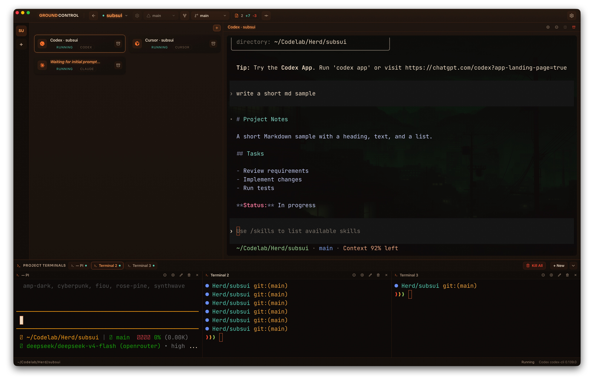
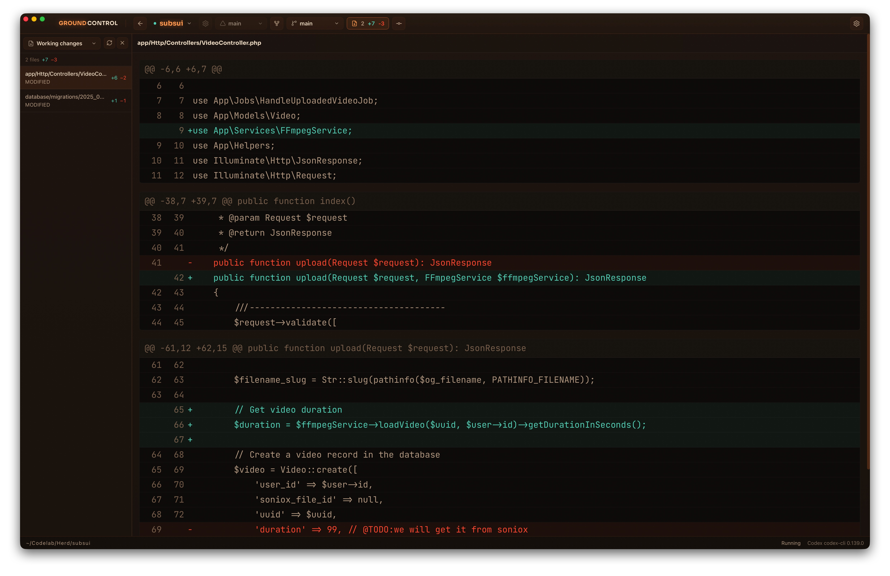

# GROUND CONTROL

A desktop app for running several AI coding agents on a project at once — and watching them work.

Launch agents like Codex, Claude, and Cursor side by side, each in its own session. Follow what they're doing live, open project terminals, and review their changes in a built-in diff viewer — all in one window.

> A learning project for [Tauri](https://tauri.app), inspired by [Mission Control](https://agentsystem.dev/mission-control).

